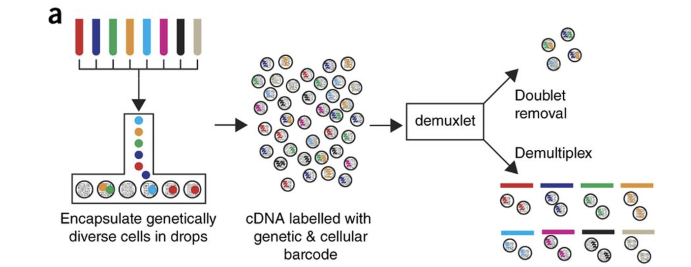
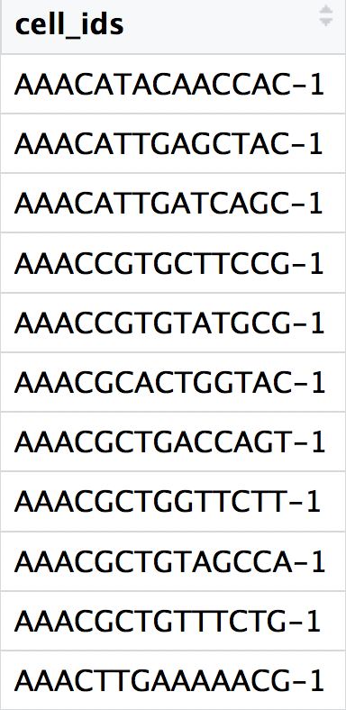
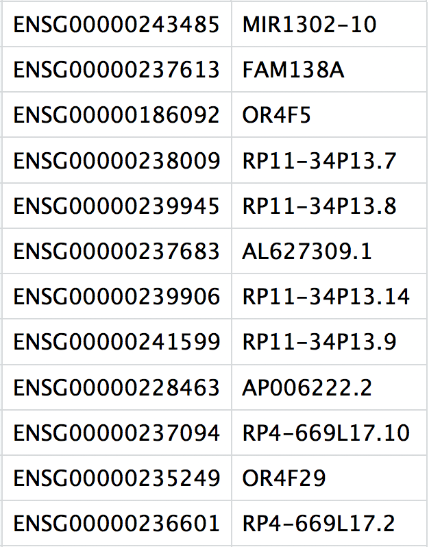
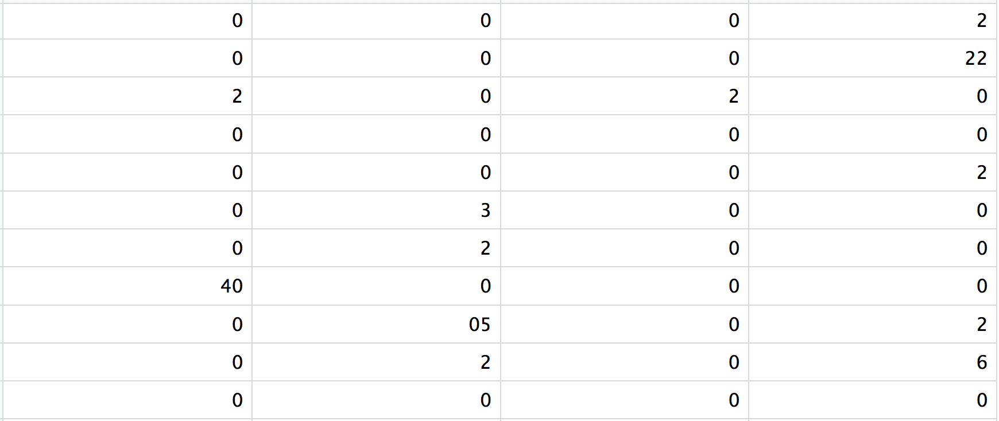

Approximate time: 90 minutes

# Learning Objectives:

* Demonstrate how to import data and set up project for upcoming quality control analysis.

# Single-cell RNA-seq: Quality control set-up


After quantifying gene expression we need to bring this data into R to generate metrics for performing QC. In this lesson we will talk about the format(s) count data can be expected in, and how to read it into python so we can move on to the QC step in the workflow. We will also discuss the dataset we will be using and the associated metadata.

***

# Exploring the example dataset

For this workshop we will be working with a single-cell RNA-seq dataset which is part of a larger study from [Kang et al, 2017](https://www.nature.com/articles/nbt.4042). In this paper, the authors present a computational algorithm that harnesses genetic variation (eQTL) to determine the genetic identity of each droplet containing a single cell (singlet) and identify droplets containing two cells from different individuals (doublets).

The data used to test their algorithm is comprised of pooled Peripheral Blood Mononuclear Cells (PBMCs) taken from eight lupus patients, split into control and interferon beta-treated (stimulated) conditions. 




*Image credit: [Kang et al, 2017](https://www.nature.com/articles/nbt.4042)*

## Raw data

This dataset is available on GEO ([GSE96583](https://www.ncbi.nlm.nih.gov/geo/query/acc.cgi?acc=GSE96583)), however the available counts matrix lacked mitochondrial reads, so we downloaded the BAM files from the SRA ([SRP102802](https://www-ncbi-nlm-nih-gov.ezp-prod1.hul.harvard.edu/sra?term=SRP102802)). These BAM files were converted back to FASTQ files, then run through [Cell Ranger](https://support.10xgenomics.com/single-cell-gene-expression/software/pipelines/latest/what-is-cell-ranger) to obtain the count data that we will be using.

::: callout-note
The count data for this dataset is also freely available from 10X Genomics and is used in the [Seurat tutorial](https://satijalab.org/seurat/v3.0/immune_alignment.html). 
:::

## Metadata

In addition to the raw data, we also need to collect **information about the data**; this is known as **metadata**. There is often a temptation to just start exploring the data, but it is not very meaningful if we know nothing about the samples that this data originated from.

Some relevant metadata for our dataset is provided below:

* The libraries were prepared using 10X Genomics version 2 chemistry
* The samples were sequenced on the Illumina NextSeq 500
* PBMC samples from eight individual lupus patients were separated into two aliquots each. 
  * One aliquot of PBMCs was activated by 100 U/mL of recombinant IFN-β for 6 hours. 
  * The second aliquot was left untreated. 
  * After 6 hours, the eight samples for each condition were pooled together in two final pools (stimulated cells and control cells). We will be working with these two, pooled samples. (*We did not demultiplex the samples because SNP genotype information was used to demultiplex in the paper and the barcodes/sample IDs were not readily available for this data. Generally, you would demultiplex and perform QC on each individual sample rather than pooling the samples.*)
* 12,138 and 12,167 cells were identified (after removing doublets) for control and stimulated pooled samples, respectively.

* Since the samples are PBMCs, we will expect immune cells, such as:
  * B cells
  * T cells
  * NK cells
  * monocytes
  * macrophages
  * possibly megakaryocytes
  
**It is recommended that you have some expectation regarding the cell types you expect to see in a dataset prior to performing the QC.** This will inform you if you have any cell types with low complexity (lots of transcripts from a few genes) or cells with higher levels of mitochondrial expression. This will enable us to account for these biological factors during the analysis workflow.

None of the above cell types are expected to be low complexity or anticipated to have high mitochondrial content.

# Set up

For this workshop, we will be working within an jupyter notebook. In order to follow along you should have **downloaded the python project**.

::: callout-important
If you haven't done this already, the project can be accessed using 
TODO.
:::

# TODO: download instructions

## Project organization

One of the most important parts of research that involves large amounts of data, is how best to manage it. We tend to prioritize the analysis, but there are many other important aspects of **data management that are often overlooked** in the excitement to get a first look at new data. The [HMS Data Management Working Group](https://datamanagement.hms.harvard.edu/), discusses in-depth some things to consider beyond the data creation and analysis.

One important aspect of data management is organization. For each experiment you work on and analyze data for, it is considered best practice to get organized by creating **a planned storage space (directory structure)**. We will do that for our single-cell analysis. 

Look inside your project space and you will find that a directory structure has been setup for you:

``` {python}
#| label: file_structure
#| eval: false 
single_cell_rnaseq/
├── data
├── results
└── figures
```

## New script

Next, open a new Jupyter Notebook file (ipynb), and start with some comments to indicate what this file is going to contain.

We will follow that up the necessary libraries to run the code for this script.

```{python}
#| label: load_libraries
# July/August 2021
# HBC single-cell RNA-seq workshop

# Single-cell RNA-seq analysis - QC

import scanpy as sc
import warnings
warnings.simplefilter(action='ignore', 
                      category=FutureWarning)
```

## Loading single-cell RNA-seq count data 

Regardless of the technology or pipeline used to process your raw single-cell RNA-seq sequence data, the output with quantified expression will generally be the same. That is, for each individual sample you will have the following **three files**:

1. A file with the **cell IDs**, representing all cells quantified
2. A file with the **gene IDs**, representing all genes quantified
3. A **matrix of counts** per gene for every cell

We can explore these files by clicking the `data/ctrl_raw_feature_bc_matrix` folder:

### 1. `barcodes.tsv` 
This is a text file which contains all cellular barcodes present for that sample. Barcodes are listed in the order of data presented in the matrix file (i.e. these are the column names). 

  



### 2. `features.tsv`
This is a text file which contains the identifiers of the quantified genes. The source of the identifier can vary depending on what reference (i.e. Ensembl, NCBI, UCSC) you use in the quantification methods, but most often these are official gene symbols. The order of these genes corresponds to the order of the rows in the matrix file (i.e. these are the row names).


  

### 3. `matrix.mtx`
This is a text file which contains a matrix of count values. The rows are associated with the gene IDs above and columns correspond to the cellular barcodes. Note that there are **many zero values** in this matrix.





Loading this data into R requires us to **use functions that allow us to efficiently combine these three files into a single count matrix.** However, instead of creating a regular matrix data structure, the functions we will use create a **sparse matrix** to reduce the amount of memory (RAM), processing capacity (CPU) and storage required to work with our huge count matrix. 

Scanpy allows us to easily read in the data by using the `read_10x_mtx()` function.


# Reading in a single sample

After processing 10X data using its proprietary software Cell Ranger, you will have an `outs` directory (always). Within this directory you will find a number of different files including the files listed below:

- **`web_summary.html`:** report that explores different QC metrics, including the mapping metrics, filtering thresholds, estimated number of cells after filtering, and information on the number of reads and genes per cell after filtering.
- **BAM alignment files:** files used for visualization of the mapped reads and for re-creation of FASTQ files, if needed
- **`filtered_feature_bc_matrix`:** folder containing all files needed to construct the count matrix using data filtered by Cell Ranger
- **`raw_feature_bc_matrix`:** folder containing all files needed to construct the count matrix using the raw unfiltered data

While Cell Ranger performs filtering on the expression counts (see note below), we wish to perform our own QC and filtering because we want to account for the biology of our experiment/biological system. Given this **we are only interested in the `raw_feature_bc_matrix` folder** in the Cell Ranger output. 

::: callout-note
# Filtered matrix
Why do we not use the `filtered_feature_bc_matrix` folder? The `filtered_feature_bc_matrix` uses [internal filtering criteria by Cell Ranger](https://support.10xgenomics.com/single-cell-gene-expression/software/pipelines/latest/algorithms/overview), and we do not have control of what cells to keep or abandon.
 
The filtering performed by Cell Ranger when generating the `filtered_feature_bc_matrix` is often good; however, sometimes data can be of very high quality and the Cell Ranger filtering process can remove high quality cells. In addition, it is generally preferable to explore your own data while taking into account the biology of the experiment for applying thresholds during filtering. For example, if you expect a particular cell type in your dataset to be smaller and/or not as transcriptionally active as other cell types in your dataset, these cells have the potential to be filtered out. However, with Cell Ranger v3 they have tried to account for cells of different sizes (for example, tumor vs infiltrating lymphocytes), and now may not filter as many low quality cells as needed.

:::

With a single sample, we can generate an AnnData object:

```{python}
#| label: load_ctrl
ad = sc.read_10x_mtx("../data/ctrl_raw_feature_bc_matrix/")
ad
```

We can see from this callout that we have 737,280 cells and 33,538 genes which is clearly too many cells! So we can do some very low level filtration to remove any cells that we know are "empty". 

The `filter_cells()` function specifies the minimum number of genes that need to be detected per cell. This argument will filter out poor quality cells that likely just have random barcodes encapsulated without any cell present. Usually, cells with less than 100 genes detected are not considered for analysis.

```{python}
#| label: filter_cells
sc.pp.filter_cells(ad, min_genes=100)
ad
```

Immediately we can see that we are now left with 15,688 cells.

# Anatomy of AnnData

There are three main "slots" with the AnnData object:

- `obs` = metadata for each cell
- `var` = metadata for each gene
- `X` and `Layers` = count matrices

## Cell metadata

To being, we will not have much metadata in our scanpy object beyond the cell barcodes themselves. When we ran the `filter_cells()` function, it automatically calculated the number of genes with non-zero expression for each cell and stored it in a column titled `n_genes`:

```{python}
#| label: anatomy_obs
ad.obs.head()
```

We can ourselves add additional metadata in the `.obs` with relevant information (sample, sex, age, timepoint, etc). In our case, we can update the sample information to keep track that these cells came from our `ctrl` sample.

```{python}
#| label: obs_add_metadata
ad.obs["sample"] = "ctrl"
ad.obs.head()
```

## Gene metadata

Similar to how there is metadata for each of our cells, we can also include information about each of the genes which will come in handy in downstream steps.

```{python}
#| label: anatomy_var
ad.var.head()
```

## Counts matrix

By default, the counts matrix will be stored in a format known as a "sparse matrix" which is a way store large matrix data in an efficient way. 

```{python}
#| label: anatomy_x
ad.X
```

To access each value in the first 5 columns and rows, we can use the `todense()` function to get a preview of what is going on:

```{python}
#| label: anatomy_dense
ad.X[1:5, 1:5].todense()
```

The values are primarily 0's which is line with our expenctation of this **zero-inflated** data. 

## Layers

The `.X` is considered to be the default layer for calculations. Since we will later normalize our data, we want to ensure that we store our raw counts in a place we can access it later by making use of `Layers` where we can store multiple different count matrices and access them at will. So to start, we are going to stash away this matrix.

We will also specify the `copy()` function to ensure that the data is copied over, and that it doesn't just point to `.X` (which may change in the future).

```{python}
#| label: cp_X
ad.layers["counts"] = ad.X.copy()
ad
```

This is reflected in our AnnData object which now contains our "counts" as a layer.

```{python}
#| label: anatomy_layers
ad.layers["counts"]
```

# Reading in multiple samples with a `for loop`

In practice, you will likely have several samples that you will need to read in data for, and that can get tedious and error-prone if you do it one at a time. So, to make the data import into python more efficient we can use a `for` loop, which will iterate over a series of commands for each of the inputs given and create AnnData objects for each of our samples. 

Today we will use it to **iterate over the two sample folders** and execute two commands for each sample as we did above for a single sample - 

1. Generate list of sample names
2. Read in the count data (`read_10x_mtx()`)
3. Filter out the very low quality data
4. Add the sample information to the metadata
5. Store AnnData to a dictionary (for later merging)

Go ahead and copy and paste the code below into your script and then run it.

```{python}
#| label: load_datasets
sample_names = ["ctrl", "stim"]
dict_ad = dict()

for sample in sample_names:
    # Get the path for each sample
    path_data = f"../data/{sample}_raw_feature_bc_matrix"
    print(path_data)

    # Load AnnData object
    # Filter and add sample metadata
    ad = sc.read_10x_mtx(path_data)
    sc.pp.filter_cells(ad, min_genes=100)
    ad.obs["sample"] = sample

    dict_ad[sample] = ad
```

Now we take a look at `dict_ad` to see if we sucessfully loaded in both of our sample. We expect to see two distinct AnnData objects in the dictionary.

```{python}
#| label: show_dict_anndata
dict_ad
```

# Merging sample together

Next, we need to merge these objects together into a single  object. This will make it easier to run the QC steps for both sample groups together and enable us to easily compare the data quality for all the samples.  

We can use the `concatenate()` function to do this. We also specify several arguments to ensure the merge is done correctly with:

- join
- batch_key
- batch_categories
- index_unique

```{python}
#| label: concatenate_datasets
# Pooling together the samples
adata = sc.AnnData.concatenate(
    *list(dict_ad.values()), # the asterisk unpacks the list
    join='outer', 
    batch_key = 'sample', 
    batch_categories = sample_names,
    index_unique = '_'
)

adata
```


If we look at the metadata of the merged object we should be able to see the correct samples in the metadata:

```{python}
#| label: show_metadata
adata.obs.head()
adata.obs.tail()
```


# Save

```{python}
#| label: save_anndata
# adata.write_h5ad("../results/03_merge.h5ad")
```