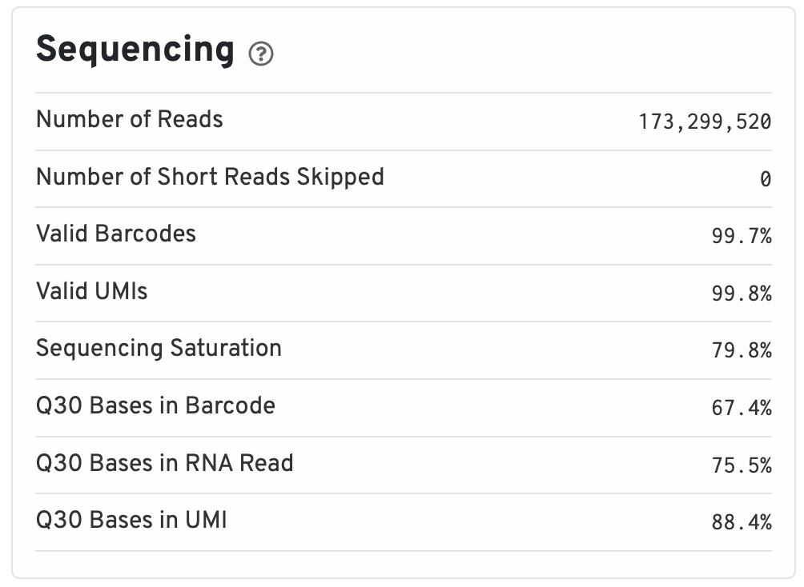
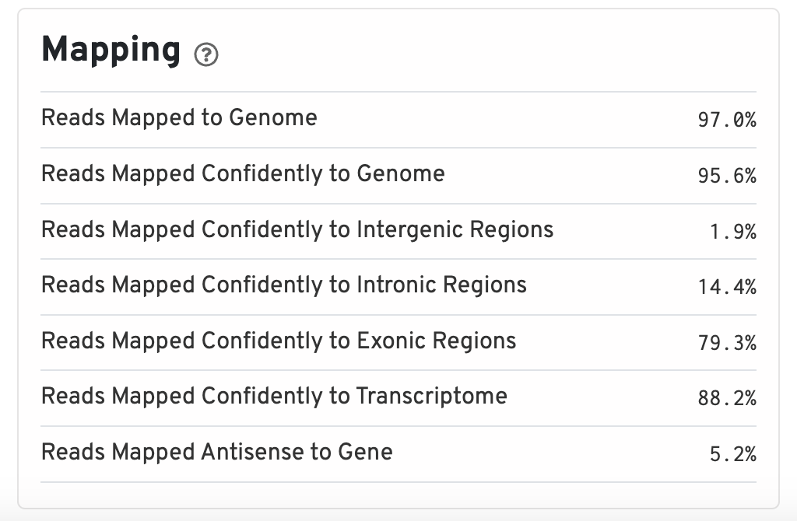
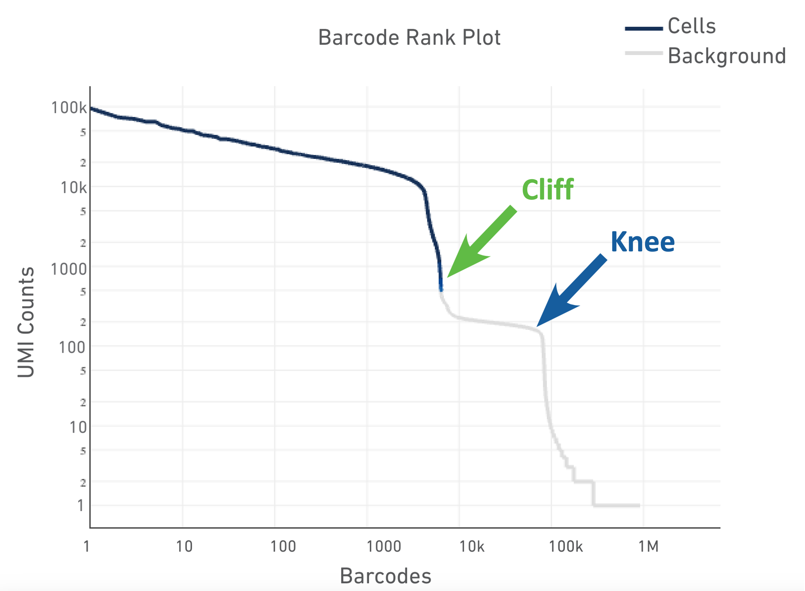
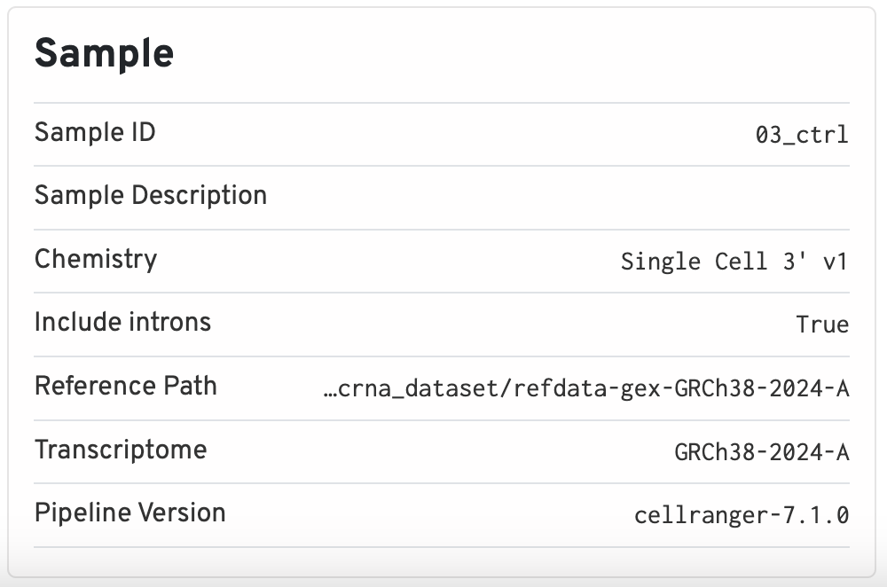
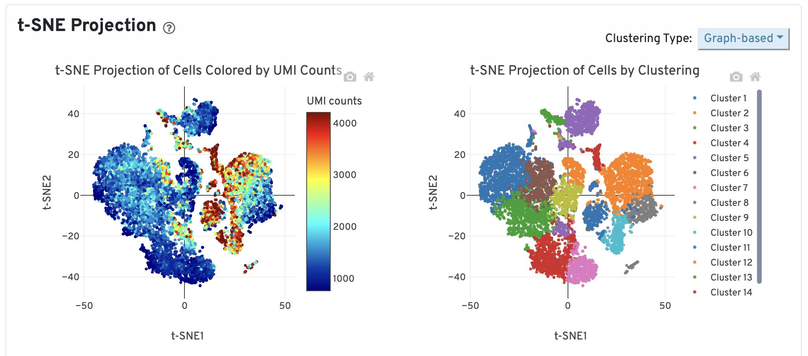
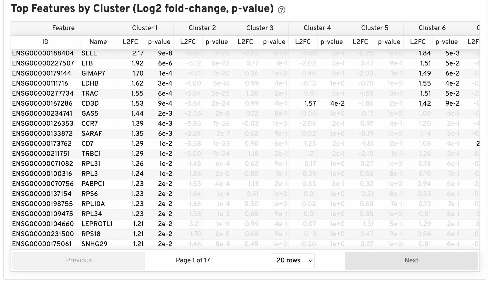
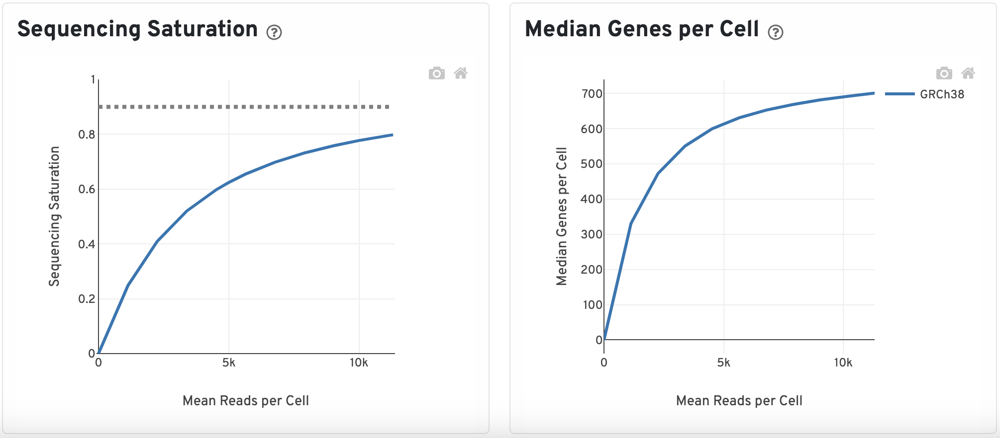

Approximate time: 30 minutes

## Learning Objectives:

* Describe how cellranger is run and what the ouputs are
* Review the cellranger generated QC report (web summary HTML)
* Create plots with cellranger metrics

# Quality control of Cellranger output

# Cellranger

[Cellranger](https://www.10xgenomics.com/support/software/cell-ranger/latest) is a tool created by the company 10x to process single-cell sequencing experiments that were processed with their kits.

The algorithm for the single-cell RNA-seq (scRNA) version of cellranger is described by 10x as follows:


*Image credit: [10x](https://www.10xgenomics.com/support/software/cell-ranger/latest/algorithms-overview/cr-gex-algorithm)*

The main elements of this pipeline are as follows:

1. Align FASTQ reads against a reference genome
2. Filter low quailty reads and correct cell barcodes/UMIs
3. Collapse on PCR duplicates using UMIs
4. Generate raw counts matrix
5. Identify low quality cells to generate a filtered counts matrix

While the focus of this workshop is scRNA, we also want to point out that there are other cellranger softwares and modes for different types of single-cell experiments.

| Experiment   | Experiment description | 10x tool |
| :----------- | :--------------------: | -------: |
| RNA     |   RNA    | [cellranger count](https://www.10xgenomics.com/support/software/cell-ranger/latest/analysis/running-pipelines/cr-gex-count) |
| ATAC     |   ATAC    | [cellranger-atac count](https://support.10xgenomics.com/single-cell-atac/software/pipelines/latest/using/count) |
| Multiome     |   RNA + ATAC   | [cellranger-arc count](https://www.10xgenomics.com/support/software/cell-ranger-arc/latest/analysis/single-library-analysis) |
| V(D)J        |   Clonotyping of T and B cells   | [cellranger vdj](https://www.10xgenomics.com/support/software/cell-ranger/latest/analysis/running-pipelines/cr-5p-vdj) |
| Hashtagging        |  Antibody/oligo tags to differentiate cells after pooling   | [cellranger multi](https://www.10xgenomics.com/support/software/cell-ranger/latest/analysis/) |


# Running Cellranger on O2

Running cellranger requires a lot of time and computational resources in order to process a single sample. Therefore, having access to a High Performance Computing (HPC) cluster is necessary to run it. Some sequencing cores will automatically process samples with cellranger and provide the outputs to you. 

Note that prior to this step, **you must have a cellranger compatible reference genome generated**. If you are working with mouse or human, 10x has pre-generated the reference which can be downloaded from their [website](https://www.10xgenomics.com/support/software/cell-ranger/downloads) for use. If you are using another organism, cellranger has a mode called [mkref](https://www.10xgenomics.com/support/software/cell-ranger/latest/tutorials/cr-tutorial-mr) which will generate everything needed for a reference from the files you supply (GTF and fasta).

Here we are showing an example of how to run `cellranger count` on Harvard's O2 HPC using SLURM. To run this script, you will have add additional information, such as:

* The name of the project (the results will be placed in a folder of the same name)
* Path to the FASTQ files from your experiment
* Path to the reference genome 

In the following **example script**, you would just have to change the variable specified in the ["Inputs for cellranger" section](https://www.10xgenomics.com/support/software/cell-ranger/latest/analysis/inputs/cr-inputs-overview) on eth 10x support site. We have already provided some optimal parameters in terms of runtime and memory for running `cellranger count`.

**You do not need to run this script.**

```{python}
#| label: cr_script
#| eval: false
#SBATCH --partition=short               # Partition name
#SBATCH --time=0-06:00                  # Runtime in D-HH:MM format
#SBATCH --nodes=1                       # Number of nodes (keep at 1)
#SBATCH --ntasks=1                      # Number of tasks per node (keep at 1)
#SBATCH --cpus-per-task=16              # CPU cores requested per task (change for threaded jobs)
#SBATCH --mem=64G                       # Memory needed per node (total)
#SBATCH --error=jobid_%j.err            # File to which STDERR will be written, including job ID
#SBATCH --output=jobid_%j.out           # File to which STDOUT will be written, including job ID
#SBATCH --mail-type=ALL                 # Type of email notification (BEGIN, END, FAIL, ALL)

module load gcc
module load cellranger/7.1.0

local_cores=16
local_mem=64

# Inputs for cellranger
project_name=""                         # Name of output
path_fastq="/path/to/fastq/"             # Path to folder with FASTQ files for one sample
path_ref="/path/to/reference/"           # Path to cellranger compatible reference


cellranger count \
    --id=${project_name} \
    --fastqs=${path_fastq} \
    --transcriptome=${path_ref} \
    --localcores=${local_cores} \
    --localmem=${local_mem}
```

## Cellranger outs

Once cellranger has finished running, there will be a folder titled `outs/` in a directory named after the `project_name` variable set above. Generation of all the following files is expected from a succesful completion of the `cellranger counts` pipeline:

```{python}
#| label: tree_cr_output
#| eval: false
├── cloupe.cloupe
├── filtered_feature_bc_matrix
│   ├── barcodes.tsv.gz
│   ├── features.tsv.gz
│   └── matrix.mtx.gz
├── filtered_feature_bc_matrix.h5
├── metrics_summary.csv
├── molecule_info.h5
├── possorted_genome_bam.bam
├── possorted_genome_bam.bam.bai
├── raw_feature_bc_matrix
│   ├── barcodes.tsv.gz
│   ├── features.tsv.gz
│   └── matrix.mtx.gz
├── raw_feature_bc_matrix.h5
└── web_summary.html
```

# Web summary HTML Report

The Web Summary HTML file is a great resource for looking at the basic quality of your sample before starting on an analysis. 10x has a [page describing each metric](https://www.10xgenomics.com/analysis-guides/quality-assessment-using-the-cell-ranger-web-summary) in depth. There are two pages/tabs included in a scRNA report titled "Summary" and "Gene Expression". 

We have included these Web Summary files for the control and stimulated samples as links below. You can **download each, and move the HTML to your project `data` folder**:

* [Control sample](https://www.dropbox.com/scl/fi/skjyyvs9078pbef7s4qvb/ctrl_web_summary.html?rlkey=335gw4qmy29uny5813wg0zakr&dl=1) report
* [Stimulated sample](https://www.dropbox.com/scl/fi/r6n83y57cd7vhc130zm1g/stim_web_summary.html?rlkey=50ur193yfsy5ex9urkmr87h3c&dl=1) report

::: callout-note
Some of the values in these reports will be slightly different from current standards, as these samples were generated using the version 1 chemistry kit and optimization have been made since then.
:::

## Summary

At the top of the "Summary" tab, under the "Alerts" header, will be a list of warnings and messages on the quality/important information about the sample. These messages are very informative on what may have gone wrong with the sample or other flags that can be set in the `cellranger count` run to gain better results.

Underneath the "Alerts" header, in green text, are the estimated number of high quality cells in the sample, average reads per cells, and median genes per cell. The number of cells will vary depending on how many were loaded in sample preparation, but some general recommendations are provided below:

* 500 cells is the **lower limit** for a good quality sample.
* 10x also recommends a minimum of 20,000 reads per cell on average.
* **The median genes per cell varies widely** across samples as it depends on sequencing depth and cell type, making it difficult to establish a good minimal value. 

The remaining 4 sections include various metrics that describe the overall quality of the sample. _Note that clicking on the grey question mark will show more detailed explanations._

## Sequencing

Includes information such as the total number of reads and how many of those reads did not meet the length requirements. Additionally, since all barcodes and UMIs are known values (from the kit used to prep scRNA experiments), we can evaluate what percentage of the barcodes and UMIs belong to that whitelist and are valid. 





Ideally, you would like to see >75% for almost all of these values since lower values are indicative of a low quality sequencing run or bad sample quality.

## Mapping

Percentage of reads that map to different regions of the reference genome as reported by STAR.





The percent of reads mapped to the genome should be on the higher end, around 85% or higher. Values that are very low could indicate that the reference genome supplied was incorrect or that the sample was problematic. Otherwise, the expectation for a scRNA runs is that the majority of reads will belong to exonic regions. If nuclei were used instead of whole cells, the percentage of reads mapping to intronic regions will be higher (~45%).

## Cells

Here we can see what an ideal representation of the Barcode Rank Plot looks like. The cells are sorted by the number of UMIs found in the cell to differentiate empty droplets/low quality cells (background) from actual cells. 





*Image credit: [10x](https://cdn.10xgenomics.com/image/upload/v1660261286/support-documents/CG000329_TechnicalNote_InterpretingCellRangerWebSummaryFiles_RevA.pdf)*

The shape of these plots can indicate a few different things about the sample:

- **Typical**: Clear cliff and knee with separation between cells and background.
- **Heterogeneous**: Bimodal plot with 2 cliffs and knees, with a clear divide between cells and background.
- **Compromised**: Round curve with a steep drop-off at the end whih indicated low quality due to many factors.
- **Compromised**: Defined cliff and knee, but with few barcodes detected could be due to inaccurate cell count or clogging.

This section additionally describes averages and medians for number of genes and reads in the sample.

## Sample

The sample section contains important metadata used by cellranger, such as what the Sample ID and the path used for the reference. The chemistry version (which 10x kit was used) and intron flags are also stored here. This information is useful for reproducibility reasons, as the version of cellranger used is also kept.





## Gene Expression

The "Gene Expression" table contains information downstream of the basic QC, such as:

### t-SNE Projection

Dotplot showing the t-SNE projection of filtered cells colored by UMI counts and clusters. The report allows you select various values of K for the K-means clustering, showing different groupings that can be generated from the data.





Later in the workshop we will spend more time on the intricacies of clustering. The requirements for this QC report would be to see clear separation of cells into groups with defined clusters - representing different cell types.

### Top Features by Cluster

This table shows the log2 fold-change and p-value for each gene and cluster after a differential expression analysis is run.





These top genes per cluster can give a brief peek into the cell type distribution of the sample. If no expected cell type marker genes appear or mitochondrial/ribosomal genes show up frequently, this can be indicative of something wrong with the sample.

### Sequencing Saturation and Median Genes per Cell

The sequencing saturation plot is a measure of library complexity. In scRNA, more genes can be detected with higher sequencing depth. At a point, you reach sequencing saturation where you do not gain any more meaningful insights which is what the dotted line represents here.


Similar to the sequencing saturation plot, looking at the median gene per cells against mean reads per cell will indicate if your have over or under-sequenced. The slope near the endpoint can be used to determine how much benefit would be gained from sequencing more deeply.



# Metrics evaluation

Many of the core pieces of information from the web summary are stored in the `metrics_summary.csv`. As this is a csv file, we can read it into python and generate plots to include in reports on the general quality of the samples.

We have included these csv files for the control and stimulated samples as links below. You can right-click on the link and "Save as..." into your **project `data` folder**:

* [Control sample](https://www.dropbox.com/scl/fi/qnz44ng51ojmhu44acc8g/ctrl_metrics_summary.csv?rlkey=8zx5g1mtn6mrlwpv0syoz3bv4&st=9d0okyhf&dl=1) `metrics.csv` file
* [Stimulated sample](https://www.dropbox.com/scl/fi/gaa4sabcbhwqpuogfh0us/stim_metrics_summary.csv?rlkey=h2uokc9r2edeinxtzgrpw3ds4&dl=1) `metrics.csv` file

First, to read the files in:

```{python}
#| label: load_cr_data
import pandas as pd
import matplotlib.pyplot as plt

%matplotlib inline

sample_names = ["ctrl", "stim"]
sample = "stim"
metrics = pd.read_csv(f"../data/{sample}_metrics_summary.csv")
metrics = metrics.transpose()
metrics[0] = metrics[0].str.replace("%", "")
metrics[0] = metrics[0].str.replace(",", "")

metrics
```

TODO generate plots